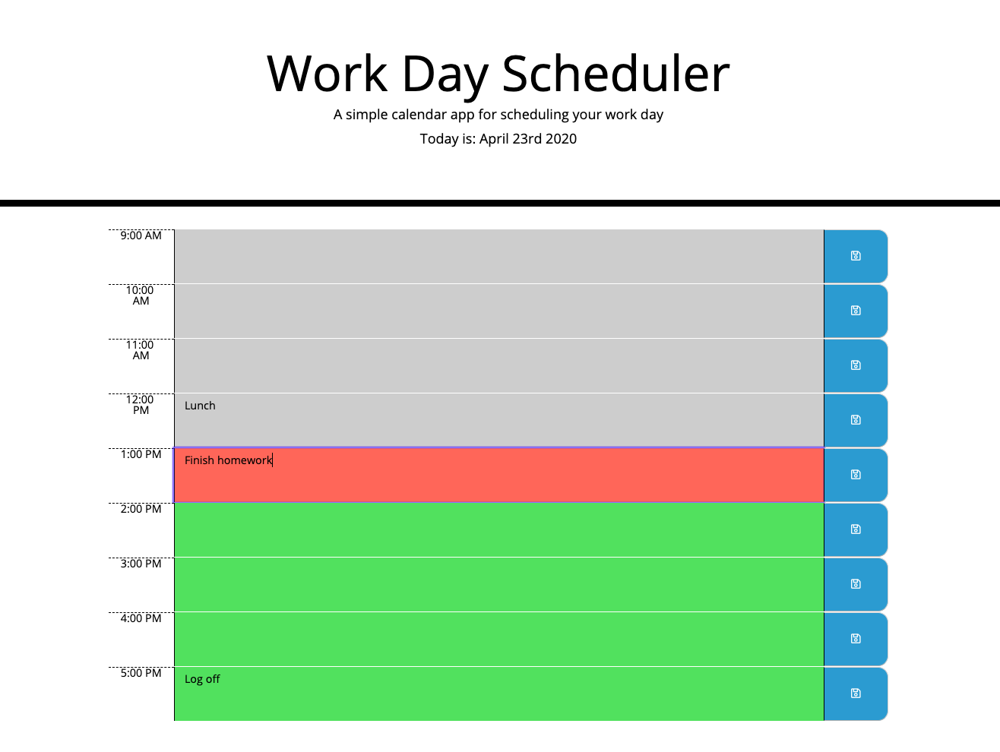

# work-day-scheduler

Application URL: https://nobobobo.github.io/word-day-scheduler/

### What is this 
This application displays time schedule for business hours of the current day.
Also it stores saved text to local storage. 

### How it works

* By using JQuery, the timeblocks are rendered with three columns (time, textarea, button) for multple rows (9:00 ~ 17:00) 
* Once the user clicks on the save icon, the event is detected and function saveSchedule() will be run.
* In saveSchedule(), user input of specifc row will be stored to local storage, and loaded when the page is being read. 
* Multiple packages: Bootstrap, fontawesome, moment() are loaded to style the page and get current time. 
